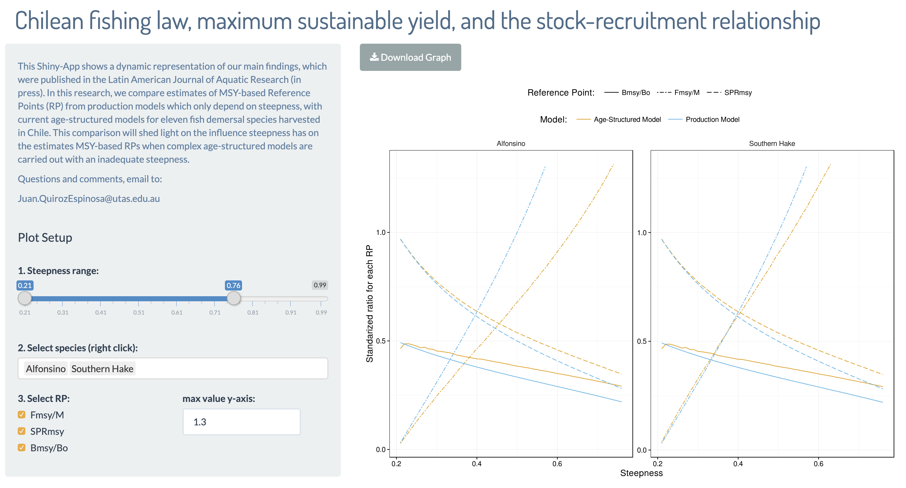
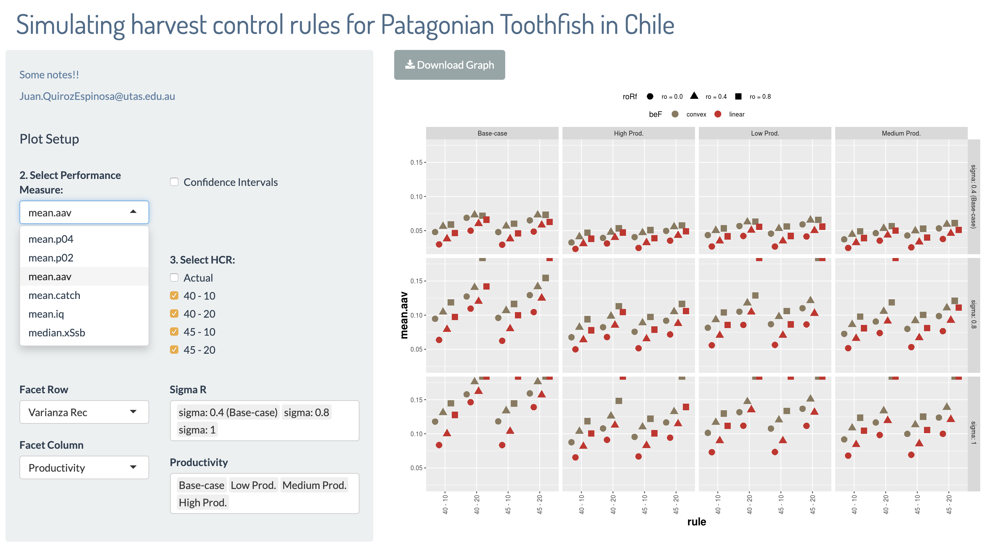
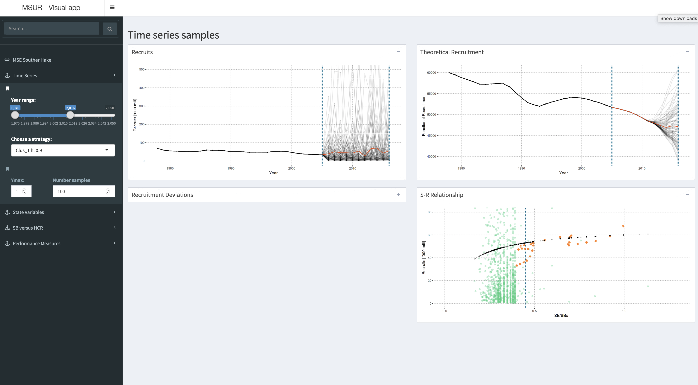

```{r setup, echo=FALSE, cache=FALSE, include=FALSE}
library(knitr)
library(rmdformats)

## Global options
#options(max.print="75")
opts_chunk$set(echo=FALSE,
	             cache=TRUE,
               prompt=FALSE,
               tidy=TRUE,
               comment=NA,
               message=FALSE,
               warning=FALSE)
opts_knit$set(width=75)

library(readxl)
library(tidyverse)
library(plotly)
library(ggthemes)
m3a <- read_excel("data/m3a_edad.xlsx", sheet = "Sheet1")
```

# Introducción
- En general, la asesoría científica se enriquece por medio de una precisa presentación de resultados 
- Precisa en: Objetivos y coherencia
- Una presentación meramente enfocada en descripción de datos deja espacio para una avalancha de preguntas
- Por esto, las técnicas de visualización se convierten en nuestras aliadas

> People know accuracy when they read it; they can feel it.


## Metodos usuales


	

	

	
	
# Esquema 

## __Parte 1:__ Manipulación de datos

Revisaremos tres tipos de visualizaciones, utilizando diferentes conjuntos de datos:

1. Estructura de edades desagregadas --- Complejidad: ``Simple``
2. Distribución espacial de lances de pesca --- Complejidad: ``Media``

## __Parte 2:__ Ejemplos

3. Exploración de resultados en estudios IFOP --- Complejidad: ``Avanzada``
- RMS para especies explotadas
- Reglas de control de captura en Bacalao de profundidad
- Simulaciones intensiva de datos: MSE
	
	
# 1) Edades en Merluza de tres aletas
## Revisando los datos

```{r data, cols.print=5, rows.print=12}
m3a
```

## Una primera vista
Queremos mostrar la captura anual (total numero) diferenciada por sexo, dando señales sobre los pesos promedios de la captura, pero **sin sobre cargar la figura**.

```{r f1, echo=TRUE}
# Usualmente se busca indicadores por grupo
t1 <-m3a %>%
  filter(year >= 2009) %>%
  group_by(year,sex) %>%
  summarise(number = sum(n)/1e6, n = n(), meanw = round(mean(weight)/1000,3))

p1 <- ggplot(t1, aes(year,number,group=meanw)) + 
  geom_bar(aes(fill=sex), stat='identity', position=position_dodge()) + 
  labs(title= NULL, x = 'year', y = 'Captura Numero [*1e6]') + guides(fill=FALSE) +
  scale_fill_manual(values=c("#999999", "#E69F00")) + theme_pander()
  

ggplotly(p1, tooltip = c("x", "y", "fill", "group"))

```

## Estructura de Edad {.tabset .tabset-fade .tabset-pills}

Es recurrente buscar patrones temporales en las composiciones de edades que permitan identificar el crecimiento individual, el éxito de cohortes que han reclutado con fuerza en la pesquería, y cambios en la fracción explotable. Sin embargo, esto se dificulta cuando los datos están agregados por estratos, por ejemplo, zonas y sexo.

### Por Año

Esta grafica compara las estructuras entre sexo para todos los años. La escala de color identifica el estrato __sexo__ y buscamos responder sobre el estrato __anual__ sin generar diferencia en la legenda. El objetivo es destacar un cambio el __año 2014__.


```{r f2, echo=TRUE}
# jitter data
t2 <- m3a %>% filter(year>= 2009) %>% mutate(n = n/1e6)
p2 <- ggplot(t2,aes(x=age, y=n, colour=sex)) +
  geom_jitter(aes(text=paste("Year: ", year)), width=0.05, alpha=0.5 ) +
  geom_line(aes(group=year), alpha = 0.2) +
  theme(axis.text.x = element_text(angle = -30, hjust = 0.1)) +
  labs(title = "Captura por edad anual", x = "Edad", y = "N [1e6]") + 
  guides(colour=FALSE) + theme_gdocs() + scale_color_wsj()
ggplotly(p2) 
```


### Por Sexo

Una exploración, esta vez, comparando entre años permite dejar evidencia del impacto en el cambio de escala en la captura posterior al 2014. Esta condición juveniliza la fracción explotada por la flota y posiblemente responde a la reducción de la captura limite.


```{r f3, echo=TRUE}
# jitter data
p3 <- ggplot(t2,aes(x=age, y=n, colour=factor(year))) +
  geom_jitter(aes(text=sex), width=0.05, alpha=0.5 ) +
  geom_line(aes(group=sex), alpha = 0.2) +
  theme(axis.text.x = element_text(angle = -30, hjust = 0.1)) +
  labs(title = "Captura por edad entre sexos", x = "Edad", y = "N [1e6]") + 
  guides(colour=FALSE) + theme_gdocs()+ scale_color_pander()
ggplotly(p3)
```


## Explicando por facetas {.tabset .tabset-fade .tabset-pills}

Hasta ahora lidiamos con tres (3) categorías (edad, sexo, año). Frente a preguntas que intenten de buscar mayor argumento a los cambios en la fracción explotable, es posible abrir las categorías y representarlas separadamente.

### Boxplots
Una exploración global que no separe los tiempos ante/después del 2014, posiblemente lleve a una confusión y solo muestre diferencia de captura entre sexos.


```{r f4, echo=TRUE}
t3 <-t2 %>% mutate(agef = factor(age))
p4 <- ggplot(t3,aes(x=agef, y=n))+
  geom_jitter(aes(colour=year, group=sex), alpha=0.5, width=0.25 ) +
  geom_boxplot(aes(fill=sex), alpha=0.8, outlier.shape = NA) +
  theme(axis.text.x = element_text(angle = -30, hjust = 0.1)) +
  labs(title = "Boxplot por sexo", x = "Edad", y = "N [1e6]") + 
  guides(fill=FALSE, colour=FALSE) + theme_gdocs() + 
  scale_fill_manual(values=c("#999999", "#E69F00")) +
  scale_color_gradientn(colours = terrain.colors(10))
ggplotly(p4, tooltip = c("x", "y", "fill", "group", "colour")) %>%
  highlight("plotly_selected")
```

### Facetas
Sin embargo, cuando se crea una nueva categoría que identifica el periodo posterior a las enmiendas en la ley (si - no), las diferencias emergen.


```{r f4a, echo=TRUE}
t3 <-t2 %>% mutate(agef = factor(age), law = ifelse(year <= 2013,"no","si") ) 
p4a <- ggplot(t3,aes(x=agef, y=n)) +
  geom_jitter(aes(colour=year, group=law), alpha=0.5, width=0.25 ) +
  geom_boxplot(aes(fill=law), alpha=0.8, outlier.shape = NA) +
  facet_grid(. ~ sex) +
  theme(axis.text.x = element_text(angle = -30, hjust = 0.1)) +
  labs(title = "Boxplot por sexo", x = "Edad", y = "N [1e6]") + 
  guides(fill=FALSE, colour=FALSE) + theme_gdocs() + 
  scale_fill_manual(values=c("#999999", "#E69F00")) +
  scale_color_gradientn(colours = terrain.colors(10))
ggplotly(p4a, tooltip = c("x", "y", "fill", "group", "colour")) %>%
  highlight("plotly_selected")
```


## Animaciones {.tabset .tabset-pills}

Si bien, las animaciones posibilitan exponer los mismos puntos que los gráficos estáticos de las secciones anteriores, facilitan llamar la atención de la audiencia y permiten integrar información auxiliar para cambiar el sentido de la charla, por ejemplo, el __peso medio a la edad__ (tamaño de círculos).


### Sobrepuesto
```{r f5, echo=TRUE}
t4 <-t3 %>% mutate(ws = (weight-min(weight))/(max(weight)-min(weight)))
    p <- ggplot(t4,aes(x=age, y=n, colour=sex, fill=sex)) +
      geom_line(aes(frame=year)) + geom_point(aes(frame=year, size=weight)) + 
      scale_fill_manual(values=c("chocolate2", "dodgerblue1")) +
      scale_color_manual(values=c("chocolate2", "dodgerblue1")) + 
      scale_size(range = c(-1, 7)) + 
      labs(title = "Captura edad", x = "Edad", y = "N [1e6]") +
      guides(colour=FALSE, fill=FALSE, size=FALSE) + theme_pander() 
    ggplotly(p, tooltip = c("x", "y", "size", "fill")) %>% 
      animation_opts(1000, easing = "elastic", redraw = FALSE) %>%
      animation_slider(currentvalue = list(prefix = "Year: ", font = list(color="goldenrod2")))
```

### Facetas
```{r f6, echo=TRUE}
t5 <-t4 %>% mutate(fishery2 = as.factor(fishery))
levels(t5$fishery2)[t5$year>=2014] <- "Trawl"
t5$fishery2[t5$year>=2014] <- "Trawl"
    p <- ggplot(t5,aes(x=age, y=n, colour=sex)) +
      geom_line(aes(frame=year)) + geom_point(aes(frame=year, size=weight)) + 
      facet_grid(. ~ sex) + 
      scale_color_manual(values=c("chocolate2", "dodgerblue1")) + 
      scale_size(range = c(-1, 7)) + 
      labs(title = "Captura edad", x = "Edad", y = "N [1e6]") +
      theme_few() + theme(legend.position = "none")
    ggplotly(p, tooltip = c("x", "y", "size")) %>% 
      animation_opts(1000, easing = "elastic", redraw = FALSE) %>%
      animation_slider(currentvalue = list(prefix = "Year: ", font = list(color="goldenrod2")))
    
```


# 2) Despliegue espacial

```{r setupes, echo=FALSE, cache=FALSE, include=FALSE}
library(ggforce)
library(nycflights13)
library(readr)
erizo <- read_csv("data/erizoToy.csv")
tmp <- erizo %>% filter(ANO_REG >= 2016) %>% 
  select(poly = POLIGONO, lon = LONGITUD, lat = LATITUD)
```


## Áreas de pesca

Usualmente clasificamos lances de pesca (registro espacial) en categorías, por ejemplo, procedencias, polígonos, áreas, flotas. Focalizar las discusiones sobre algunas categorías es usual y para esto una representación grafica sencilla permite mayor comunicación.


```{r f7, echo=TRUE}
p <- tmp %>%
  filter(lon != 0, lat != 0, poly >= 1) %>% mutate(polyf = factor(poly)) %>%
  ggplot(aes(lon, lat, color = polyf)) + 
  geom_jitter(show.legend = FALSE, width = 0.01, height = 0.02, size = 0.5) +
  theme_pander()
ggplotly(p)
```


## Construyendo Polígonos {.tabset .tabset-fade .tabset-pills}

Basado en nuestro objetivo de comunicación, podemos centrarnos en diferentes 

### Simple


```{r f8, echo=TRUE}
p +
  geom_mark_rect() 
```

### Etiquetas

```{r f9, echo=TRUE}
p + 
  geom_mark_rect(aes(label = polyf), show.legend = FALSE) +
  theme_void() 
```


### Colores

```{r f10, echo=TRUE}
p + 
  geom_mark_hull(aes(label = polyf, fill = polyf), show.legend = FALSE) +
  theme_void() 
```
 

### Polígonos

```{r f11, echo=TRUE}
p + 
  geom_mark_hull(aes(label = polyf, fill = polyf), show.legend = FALSE, expand = unit(2, "mm")) +
  theme_pander()
```

## Selección por cuadrante

En ocasiones queremos llevar al publico a un especifico detalle en los datos, para esto podemos seleccionar un cuadrante con bordes ``lon*lat``


```{r f12, echo=TRUE}
p +
  geom_mark_hull(aes(label = polyf, fill = polyf), show.legend = FALSE, expand = unit(2, "mm")) +
  theme_pander() +
  facet_zoom(xlim = c(-73.5, -73), ylim = c(-43, -42))
```


## Selección por polígono

También podemos seleccionar un polígono en especifico, o varios de estos.


```{r f13, echo=TRUE}
p +
  geom_mark_hull(aes(label = polyf, fill = polyf), show.legend = FALSE, expand = unit(2, "mm")) +
  theme_pander() +
  facet_zoom(xy = polyf == 4)
```


# 3) Resultados de nuestros estudios

## Rendimiento Máximo Sostenible



https://jcqui.shinyapps.io/steepness-msy/


## Reglas de control de captura (Bacalao)


https://jcqui.shinyapps.io/behavior-hcr/


## Simulaciones en Merluza del sur


https://jcquiroz.shinyapps.io/MSE_Southern_Hake/ 


# Gracias!!

- Esta presentación contiene aprox. 350 líneas de código
- Conocimiento medio (como el mío) ~5-6 horas de preparación
- No más de 7 librerías de ``R``


```{r f14, echo=TRUE}
library(rmdformats)
library(readxl)
library(tidyverse)
library(plotly)
library(ggthemes)
library(ggforce)
library(readr)
```

Gracias a Mauro Mardones y Francisco Contreras por los datos


